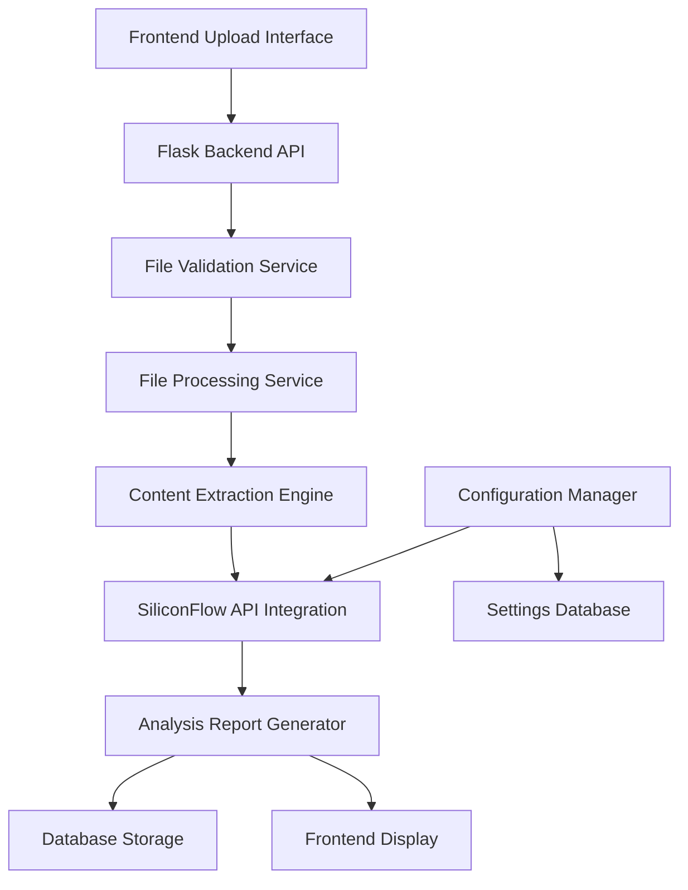

# Design Document

## Overview

The AI Analysis Module refactoring will extend the existing Flask-based research efficiency management platform to support multi-format file uploads and AI-powered analysis using SiliconFlow's API. The module will integrate seamlessly with the current architecture while adding new capabilities for document processing and analysis.

## Architecture

### High-Level Architecture



### Component Integration

The AI analysis module will integrate with the existing Flask application (`backend/app.py`) by adding new routes and services while leveraging the current database infrastructure and frontend architecture.

## Components and Interfaces

### 1. File Upload Handler

**Location**: `backend/services/file_handler.py`

**Responsibilities**:
- Handle multipart file uploads
- Validate file formats (PDF, MD, XLSX, XLS, DOCX, DOC, TXT)
- Enforce 5MB size limit
- Generate unique file identifiers
- Temporary file storage management

**Interface**:
```python
class FileUploadHandler:
    def validate_file(self, file) -> ValidationResult
    def save_temp_file(self, file) -> str
    def cleanup_temp_file(self, file_path: str) -> None
```

### 2. Content Extraction Engine

**Location**: `backend/services/content_extractor.py`

**Responsibilities**:
- Extract text content from different file formats
- Handle format-specific processing
- Return standardized text output
- Error handling for corrupted files

**Interface**:
```python
class ContentExtractor:
    def extract_pdf(self, file_path: str) -> str
    def extract_markdown(self, file_path: str) -> str
    def extract_excel(self, file_path: str) -> str
    def extract_word(self, file_path: str) -> str
    def extract_text(self, file_path: str) -> str
    def extract_content(self, file_path: str, file_type: str) -> str
```

### 3. SiliconFlow API Client

**Location**: `backend/services/siliconflow_client.py`

**Responsibilities**:
- Manage API authentication
- Send analysis requests to SiliconFlow
- Handle API responses and errors
- Implement retry logic and rate limiting

**Interface**:
```python
class SiliconFlowClient:
    def __init__(self, api_key: str)
    def analyze_content(self, content: str, custom_prompt: str = None) -> AnalysisResult
    def _build_request_payload(self, content: str, prompt: str) -> dict
    def _handle_api_response(self, response) -> AnalysisResult
```

### 4. Analysis Report Generator

**Location**: `backend/services/report_generator.py`

**Responsibilities**:
- Format AI analysis results
- Generate structured reports
- Add metadata (filename, timestamp, etc.)
- Support multiple output formats

**Interface**:
```python
class ReportGenerator:
    def generate_report(self, analysis_result: AnalysisResult, metadata: dict) -> Report
    def format_html_report(self, report: Report) -> str
    def format_json_report(self, report: Report) -> dict
```

### 5. Configuration Manager

**Location**: `backend/services/config_manager.py`

**Responsibilities**:
- Load and manage API keys
- Handle custom prompt configurations
- Provide default settings
- Validate configuration values

**Interface**:
```python
class ConfigManager:
    def get_api_key(self) -> str
    def get_custom_prompt(self) -> str
    def set_custom_prompt(self, prompt: str) -> None
    def get_default_prompt(self) -> str
```

## Data Models

### 1. File Upload Model

```python
@dataclass
class FileUpload:
    id: str
    filename: str
    file_type: str
    file_size: int
    upload_timestamp: datetime
    status: str  # 'uploaded', 'processing', 'completed', 'failed'
```

### 2. Analysis Result Model

```python
@dataclass
class AnalysisResult:
    id: str
    file_id: str
    content: str
    analysis_text: str
    prompt_used: str
    processing_time: float
    created_at: datetime
    status: str
```

### 3. Configuration Model

```python
@dataclass
class AIConfig:
    api_key: str
    custom_prompt: Optional[str]
    default_prompt: str
    max_file_size: int
    supported_formats: List[str]
```

### Database Schema Extensions

```sql
-- Add to existing database
CREATE TABLE IF NOT EXISTS ai_analysis_files (
    id TEXT PRIMARY KEY,
    filename TEXT NOT NULL,
    file_type TEXT NOT NULL,
    file_size INTEGER NOT NULL,
    upload_timestamp DATETIME DEFAULT CURRENT_TIMESTAMP,
    status TEXT DEFAULT 'uploaded'
);

CREATE TABLE IF NOT EXISTS ai_analysis_results (
    id TEXT PRIMARY KEY,
    file_id TEXT NOT NULL,
    analysis_text TEXT NOT NULL,
    prompt_used TEXT,
    processing_time REAL,
    created_at DATETIME DEFAULT CURRENT_TIMESTAMP,
    FOREIGN KEY (file_id) REFERENCES ai_analysis_files (id)
);

CREATE TABLE IF NOT EXISTS ai_config (
    id INTEGER PRIMARY KEY,
    api_key TEXT NOT NULL,
    custom_prompt TEXT,
    updated_at DATETIME DEFAULT CURRENT_TIMESTAMP
);
```

## Error Handling

### 1. File Validation Errors

- **Unsupported Format**: Return HTTP 400 with specific format requirements
- **File Too Large**: Return HTTP 413 with size limit information
- **Corrupted File**: Return HTTP 422 with file integrity error

### 2. Content Extraction Errors

- **PDF Extraction Failure**: Fallback to OCR or return partial content
- **Excel Processing Error**: Handle protected sheets and formula errors
- **Word Document Issues**: Handle password-protected documents

### 3. API Integration Errors

- **Authentication Failure**: Return HTTP 401 with API key validation message
- **Rate Limiting**: Implement exponential backoff and queue requests
- **Network Timeout**: Retry with increasing intervals
- **API Response Errors**: Parse and return meaningful error messages

### 4. Configuration Errors

- **Missing API Key**: Return HTTP 500 with configuration guidance
- **Invalid Prompt**: Validate prompt length and content
- **Database Connection**: Handle database unavailability gracefully

## Testing Strategy

### 1. Unit Tests

**File Upload Handler Tests**:
- Test file format validation for all supported types
- Test file size validation with edge cases
- Test temporary file management and cleanup

**Content Extractor Tests**:
- Test extraction for each file format with sample files
- Test error handling for corrupted files
- Test encoding detection and handling

**SiliconFlow Client Tests**:
- Mock API responses for successful analysis
- Test error handling for various API failures
- Test request payload construction

### 2. Integration Tests

**End-to-End File Processing**:
- Upload → Extract → Analyze → Report workflow
- Test with real files of each supported format
- Verify database persistence and retrieval

**API Integration Tests**:
- Test actual SiliconFlow API integration (with test account)
- Verify prompt customization functionality
- Test configuration management

### 3. Performance Tests

**File Processing Performance**:
- Test with maximum file sizes (5MB)
- Measure processing time for different formats
- Test concurrent file uploads

**API Response Time**:
- Measure SiliconFlow API response times
- Test with various content lengths
- Monitor rate limiting behavior

### 4. Security Tests

**File Upload Security**:
- Test malicious file upload attempts
- Verify file type validation cannot be bypassed
- Test path traversal prevention

**API Key Security**:
- Verify API key is not exposed in responses
- Test configuration file security
- Validate secure storage practices

## Implementation Dependencies

### Python Libraries Required

```python
# File processing
PyPDF2==3.0.1          # PDF text extraction
python-docx==0.8.11     # Word document processing
openpyxl==3.1.2         # Excel file processing
markdown==3.5.1         # Markdown processing

# API integration
requests==2.31.0        # HTTP client for SiliconFlow API
urllib3==2.0.7          # HTTP utilities

# File handling
python-magic==0.4.27    # File type detection
werkzeug==2.3.7         # File upload utilities (already in Flask)

# Utilities
uuid==1.30              # Unique ID generation
dataclasses==0.6        # Data models (Python 3.7+)
```

### Configuration Files

**config/ai_config.json**:
```json
{
  "siliconflow": {
    "api_key": "sk-cgeodmtqtwhrrcaqppopyblkvfwcggowlqryvqwyhoivfiub",
    "base_url": "https://api.siliconflow.cn/v1",
    "model": "gpt-3.5-turbo",
    "max_tokens": 4000,
    "temperature": 0.7
  },
  "file_processing": {
    "max_file_size": 5242880,
    "supported_formats": ["pdf", "md", "xlsx", "xls", "docx", "doc", "txt"],
    "temp_dir": "temp/uploads"
  },
  "prompts": {
    "default": "请分析以下文档内容，提供详细的分析报告，包括主要内容总结、关键信息提取和建议。",
    "custom": null
  }
}
```

## API Endpoints Design

### New Routes to Add

```python
# File upload and analysis
POST /api/ai-analysis/upload
GET /api/ai-analysis/results/<analysis_id>
GET /api/ai-analysis/history
DELETE /api/ai-analysis/results/<analysis_id>

# Configuration management
GET /api/ai-analysis/config
POST /api/ai-analysis/config
PUT /api/ai-analysis/config/prompt

# File management
GET /api/ai-analysis/files
DELETE /api/ai-analysis/files/<file_id>
```

### Request/Response Formats

**Upload Request**:
```
POST /api/ai-analysis/upload
Content-Type: multipart/form-data

file: [binary file data]
custom_prompt: [optional custom prompt]
```

**Upload Response**:
```json
{
  "success": true,
  "file_id": "uuid-string",
  "analysis_id": "uuid-string",
  "status": "processing",
  "estimated_completion": "2024-01-15T10:30:00Z"
}
```

**Analysis Result Response**:
```json
{
  "id": "analysis-uuid",
  "file_info": {
    "filename": "document.pdf",
    "file_type": "pdf",
    "file_size": 1024000,
    "upload_time": "2024-01-15T10:00:00Z"
  },
  "analysis": {
    "content": "分析结果内容...",
    "prompt_used": "自定义提示词或默认提示词",
    "processing_time": 15.5,
    "created_at": "2024-01-15T10:15:30Z"
  },
  "status": "completed"
}
```